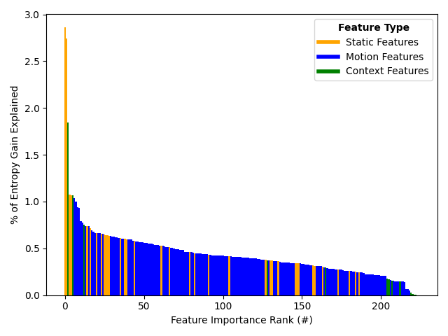

Unique Identification of 50,000+ Virtual Reality Users from Head & Hand Motion Data

[](https://github.com/MetaGuard/Identification/issues)
[](https://github.com/MetaGuard/Identification/blob/master/LICENSE)

[Paper](https://arxiv.org/abs/2302.08927) |
[Website](https://rdi.berkeley.edu/vr-identification/)

With the recent explosive growth of interest and investment in virtual reality (VR) and the so-called "metaverse," public attention has rightly shifted toward the unique security and privacy threats that these platforms may pose. While it has long been known that people reveal information about themselves via their motion, the extent to which this makes an individual globally identifiable within virtual reality has not yet been widely understood. In this study, we show that a large number of real VR users (N=55,541) can be uniquely and reliably identified across multiple sessions using just their head and hand motion relative to virtual objects. After training a classification model on 5 minutes of data per person, a user can be uniquely identified amongst the entire pool of 50,000+ with 94.33% accuracy from 100 seconds of motion, and with 73.20% accuracy from just 10 seconds of motion. This work is the first to truly demonstrate the extent to which biomechanics may serve as a unique identifier in VR, on par with widely used biometrics such as facial or fingerprint recognition.

#### Dependencies
We use Node.js v16.15.0 for featurization and Python v3.10.2 for everything else. The names and recommended versions of all Python dependencies are listed below.
- PyTorch (torch) v1.13.1
- pandas v1.5.2
- tqdm v4.64.1
- scikit-learn (sklearn) v1.2.0
- NumPy (numpy) v1.24.0
- LightGBM (lightgbm) v3.3.3
- Joblib (joblib) v1.2.0
- NetworkX (networkx) v3.0
- Matplotlib (matplotlib) v3.6.2

#### Usage
- Featurization: `featurzation/`
  - Run `sh parse.sh`
- Normalization: `0-`
  - Run `py 0-normalize.py`
- Training: `1-` through `5-`
  - To train layers 1 and 2, run `py 1-train_layer_1.py` and `py 2-train_layer_2.py`
  - To form clusters for layer 3, run `py 3-test_and_cluster.py` and `py 4-generate_groups.py`
  - To train layer 3, run `py 5-train_layer_3.py`
- Evaluation: `6-` through `8-`
  - To test layer 3, run `py 6-test_layer_3.py`
  - To get final results, run `py 7-stats_final.py`
  - To run model explanations, run `py 8-explain.py`
  - To test the open-world scenario, run `py 9-open_world.py`

#### Sample Results
```
           Stage  Models Time (Per Model)  Time (Overall) Accuracy
0  Featurization      32      13h 39m 16s      14h 5m 18s      N/A
1  Normalization       1       1h 11m 34s      1h 11m 34s      N/A
2        Layer 1      10        3h 9m 52s   1d 7h 38m 43s   91.95%
3        Layer 2      10       3h 19m 38s   1d 9h 16m 27s   89.29%
4     Clustering      20       5h 37m 58s  4d 16h 42m 49s      N/A
5        Layer 3      18        0h 3m 44s       1h 7m 26s   77.89%
6        Testing      20       5h 38m 12s  4d 16h 43m 37s   95.35%
```



_We appreciate the support of the National Science Foundation, the National Physical Science Consortium, the Fannie and John Hertz Foundation, and the Berkeley Center for Responsible, Decentralized Intelligence._
